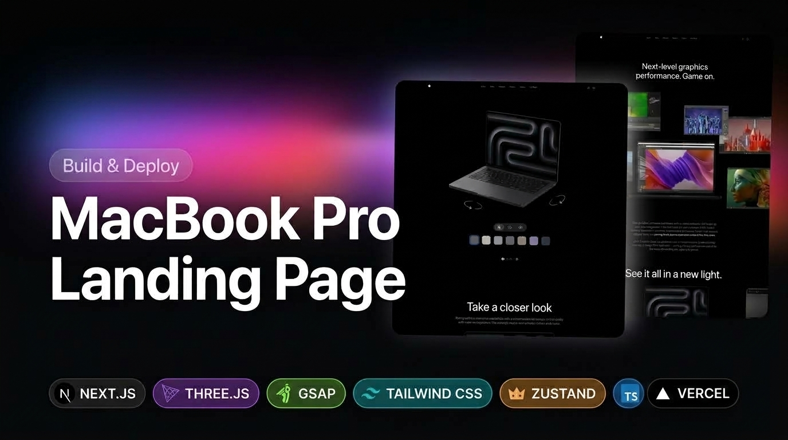

<div align="center">
  
</div>

# MacBook Pro — Interactive Landing Page

> A pixel-perfect, scroll-driven product landing page inspired by Apple's MacBook Pro marketing site, built with **Next.js 16**, **Three.js**, and **GSAP**.

---

## ✨ Features

| Section                  | What it Does                                                                                                                                                                                         |
| ------------------------ | ---------------------------------------------------------------------------------------------------------------------------------------------------------------------------------------------------- |
| **Hero**                 | Full-screen cinematic video at 2× playback speed with product title and CTA                                                                                                                          |
| **3D Product Viewer**    | Interactive WebGL canvas powered by `@react-three/fiber` — rotate the MacBook with touch/mouse, switch between **14″** and **16″** models, and choose between **Silver** and **Space Grey** finishes |
| **Rocket Chip Showcase** | Scroll-pinned section with a masked video reveal and chip performance stats (4× faster, 1.5× CPU)                                                                                                    |
| **Features**             | Full-page 3D scroll scene — the MacBook spins 360° as you scroll while five Apple Intelligence feature cards fade in sync with screen texture changes                                                |
| **Performance Gallery**  | Scroll-animated floating image collage (desktop) and touch carousel (mobile/tablet)                                                                                                                  |
| **Highlights**           | Masonry-style staggered reveal of MacBook Pro key specs                                                                                                                                              |
| **Footer**               | Standard Apple-style footer with policy links                                                                                                                                                        |

---

## 🛠 Tech Stack

| Category            | Library / Tool                                                   | Version  |
| ------------------- | ---------------------------------------------------------------- | -------- |
| Framework           | [Next.js](https://nextjs.org)                                    | 16.3.5   |
| UI Runtime          | React                                                            | 19.2.8   |
| 3D Rendering        | [Three.js](https://threejs.org)                                  | ^0.186.0 |
| React–Three Bridge  | [@react-three/fiber](https://docs.pmnd.rs/react-three-fiber)     | ^9.7.0   |
| Three.js Helpers    | [@react-three/drei](https://github.com/pmndrs/drei)              | ^10.7.8  |
| Scroll Animations   | [GSAP](https://gsap.com) + ScrollTrigger + SplitText             | ^3.15.0  |
| GSAP–React Bridge   | [@gsap/react](https://gsap.com/react/)                           | ^2.1.2   |
| Global State        | [Zustand](https://zustand-demo.pmnd.rs) (with `persist`)         | ^5.0.15  |
| Styling             | [Tailwind CSS v4](https://tailwindcss.com)                       | ^4       |
| Responsive Utils    | [react-responsive](https://github.com/yocontra/react-responsive) | ^10.0.1  |
| Conditional Classes | [clsx](https://github.com/lukeed/clsx)                           | ^2.1.1   |
| Language            | TypeScript                                                       | ^5       |
| Package Manager     | pnpm                                                             | 12.6.0   |

---

## 🗂 Project Structure

```
.
├── providers/
│   └── GsapProvider.tsx         # Registers GSAP plugins (ScrollTrigger, SplitText) client-side
├── public/
│   ├── fonts/                   # Custom Apple-style OTF typefaces (9 weights: thin → black)
│   ├── models/                  # GLTF/GLB assets — original + gltfjsx-transformed versions
│   │   ├── macbook.glb / macbook-transformed.glb
│   │   ├── macbook-14.glb / macbook-14-transformed.glb
│   │   └── macbook-16.glb / macbook-16-transformed.glb
│   ├── videos/                  # hero.mp4, game.mp4, feature-1…5.mp4
│   └── *.png / *.svg            # Performance images, feature icons, UI assets
└── src/
    ├── app/
    │   ├── layout.tsx           # Root layout — wraps app in GsapProvider + StoreProvider
    │   ├── page.tsx             # Landing page — composes all sections
    │   ├── globals.css          # Global Tailwind + CSS custom properties
    │   └── lesson/              # Self-contained Three.js learning sandbox (not shipped to prod)
    │       ├── page.tsx         # Lesson index with links
    │       ├── layout.tsx       # Lesson layout
    │       ├── play/page.tsx    # Core Three.js lesson (vanilla)
    │       └── fiber-drei/page.tsx  # @react-three/fiber + drei lesson
    ├── components/
    │   ├── NavBar.tsx           # Sticky top nav with Apple logo + GitHub link
    │   ├── Hero.tsx             # Hero section with video + CTA
    │   ├── ProductViewer.tsx    # WebGL canvas, color + size controls
    │   ├── Showcase.tsx         # Scroll-pinned Rocket Chip reveal
    │   ├── Performance.tsx      # Floating image collage / mobile carousel
    │   ├── Features.tsx         # 360° scroll model + AI feature cards
    │   ├── Highlights.tsx       # Masonry spec highlights
    │   ├── Footer.tsx           # Footer with policy links
    │   ├── GitHubIcon.tsx       # SVG icon component
    │   ├── models/
    │   │   ├── Macbook.tsx      # Base MacBook GLB (Features scroll section)
    │   │   ├── Macbook-14.tsx   # 14″ MacBook Pro GLB model
    │   │   ├── Macbook-16.tsx   # 16″ MacBook Pro GLB model
    │   │   └── ModelScroll.tsx  # GSAP-driven scroll + texture sync model
    │   └── three/
    │       ├── ModelSwitcher.tsx   # Fades & slides between 14″ / 16″ models
    │       ├── ScreenMaterial.tsx  # VideoTexture applied to laptop screen mesh
    │       ├── StudioLights.tsx    # Three-point studio lighting rig
    │       └── type.ts             # Shared GLTF + GroupProps TypeScript types
    ├── constants/
    │   └── insex.ts             # Nav links, feature data, performance images, GLTF part names
    ├── hooks/
    │   └── useIsMounted.ts      # SSR-safe hydration guard for WebGL canvas
    └── store/
        ├── store.ts             # Zustand store factory (color, scale, texture)
        └── store-provider.tsx   # React context provider wrapping createAppStore
```

---

## 🚀 Getting Started

### Prerequisites

- **Node.js** ≥ 20
- **pnpm** ≥ 12 — install with `npm i -g pnpm`

### Installation

```bash
# 1. Clone the repository
git clone https://github.com/Mojahedhu/three_gsap_mackbook_landing.git
cd three_gsap_mackbook_landing

# 2. Install dependencies
pnpm install

# 3. Start the development server
pnpm dev
```

Open [http://localhost:3000](http://localhost:3000) in your browser.

### Available Scripts

| Command      | Description                          |
| ------------ | ------------------------------------ |
| `pnpm dev`   | Start Next.js dev server with HMR    |
| `pnpm build` | Create an optimised production build |
| `pnpm start` | Serve the production build           |
| `pnpm lint`  | Run ESLint across the project        |

---

## 🎮 Interactive Controls

### 3D Product Viewer

- **Drag / Touch** — rotate the MacBook freely in all directions using `PresentationControls`
- **Color buttons** — toggle between Silver (`#adb5bd`) and Space Grey (`#2e2c2e`); the GLTF mesh colors update reactively via Zustand
- **14″ / 16″ buttons** — switch models with a smooth GSAP fade + slide transition

### Features Section

- Scroll through the pinned canvas to spin the MacBook 360° and watch five Apple Intelligence feature cards reveal in sequence, each syncing a new video texture on the laptop screen

---

## 🏗 Architecture Notes

### Provider Tree

```
<GsapProvider>           ← Registers GSAP plugins once, client-side only
  <StoreProvider>        ← Creates & hydrates Zustand store via React Context
    {children}
  </StoreProvider>
</GsapProvider>
```

### State Management

User preferences (colour finish, model size, active screen texture) are managed in a **Zustand** store and persisted to `localStorage` under the key `"Cube-Store"` using the `persist` middleware. The store uses `skipHydration: true` to avoid SSR mismatches; hydration is triggered manually after mount.

### GSAP Plugin Registration

GSAP's `ScrollTrigger` and `SplitText` plugins are registered once in `GsapProvider` using an `if (typeof window !== "undefined")` guard, ensuring they are never executed server-side.

### Custom Fonts

The project ships nine Apple-style OTF typeface weights (`thin` → `black`) loaded from `public/fonts/`. Google Fonts (`Geist`, `Geist Mono`) are additionally loaded via `next/font` for UI text.

---

## ♿ Accessibility

The project respects the OS-level **"Reduce Motion"** preference throughout:

| Component                | Reduced-Motion Behaviour                                                           |
| ------------------------ | ---------------------------------------------------------------------------------- |
| `Showcase`               | Disables scroll-pinned scale animation; video autoplay also suppressed             |
| `Features / ModelScroll` | Skips 360° rotation timeline; all feature boxes shown instantly via `gsap.set`     |
| `Highlights`             | Skips staggered column reveal; both columns shown immediately                      |
| `Performance`            | Shows paragraph + collage images at their final positions without scroll animation |

---

## ⚙️ Configuration

### `next.config.ts`

```ts
const nextConfig = {
  transpilePackages: ["three"], // Required for Three.js ESM modules
  reactCompiler: true, // Enables React Compiler (auto-memoisation)
  images: {
    qualities: [75, 90], // Allowed Next.js image quality levels
  },
};
```

---

## 🌐 Deployment

This is a standard Next.js 16 app and can be deployed to any platform that supports Node.js. **Vercel** is the recommended host.

> **Important:** The deployment server runs on a **case-sensitive Linux filesystem**. All import paths must exactly match the physical file name casing — e.g. `@/components/Performance` must match `Performance.tsx` (capital **P**).

```bash
pnpm build   # Verify the build passes locally before pushing
```

---

## 🧪 Lesson Sandbox

The `/lesson` route (`src/app/lesson/`) is a self-contained Three.js learning environment and is not part of the production landing page. It contains:

- `/lesson/play` — Vanilla Three.js core concepts
- `/lesson/fiber-drei` — `@react-three/fiber` and `@react-three/drei` exploration

---

## 📄 License

3D models used in this project are sourced from Sketchfab under the **CC-BY-4.0** licence.  
Original model: _MacBook Pro M3 16 inch 2024_ by [jackbaeten](https://sketchfab.com/jackbaeten).

---

## 🙏 Credits

Built following the tutorial series by **Adrian** (JS Mastery).
